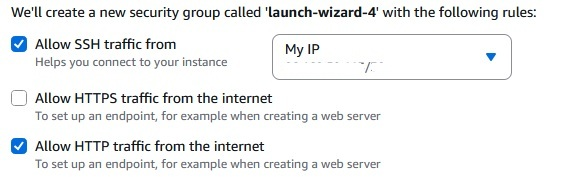

# EC2 + NGINX + Custom Domain Setup

This project documents the steps I took to set up an **NGINX web server on AWS EC2** and connect it to a **custom domain** via Cloudflare / Route53.  

---

## 1. Buy a Domain
- Registered a domain using **AWS Route53 → Registered domains**.
- Example domain: `aftabn10.co.uk`
*can also be done via Cloudflare*

📸 *Screenshot: Domain registration page*

---

## 2. Launch an EC2 Instance
- Logged into **AWS Console → EC2 → Launch Instances**.
- Configurations:
  - **AMI**: Amazon Linux 2023
  - **Instance type**: `t2.micro` (Free Tier)
  - **Security group**: Allowed inbound traffic on:
    - Port 22 (SSH)
    - Port 80 (HTTP)
- Generated a new key pair and downloaded it onto local machine.
 

---

## 3. Install and Start NGINX
Connected via SSH:
```bash
ssh -i my-key.pem ubuntu@<EC2_PUBLIC_IP>
```

Install and enabled NGINX
```bash
sudo yum update -y
sudo yum install nginx -y
sudo systemctl start nginx
sudo systemctl enable nginx
```
Verified it works
```bash
systemctl status nginx
```


What I was looking for here was to see the status and as you seen from the image, the **status** shows its active and running. 

Tested in browser:
```cpp
http://<EC2_PUBLIC_IP>
```


## 4. Configure DNS in Route53

- Went to Route53 → Hosted zones.
- Selected the hosted zone for my domain (myname.co.uk).
- Created an A Record:
-Record name: nginx (so this shows up as nginx.domain.co.uk)

Record type: A

Value: <EC2_PUBLIC_IP>

Routing policy: Simple

TTL: Default (300 seconds)

## 5. Test the Domain

Visited:
```
http://nginx.aftabn10.co.uk
```


## 6. Stop the Instance 

- After Testing, I stopped the EC2 instance to avoid any compute charges and deleted the A record to ensure everything is on point.

## Summary

:heavy_check_mark: Registered domain in Route53<br>
:heavy_check_mark: Deployed EC2 instance with NGINX<br>
:heavy_check_mark: Configured DNS A record in Route53<br>
:heavy_check_mark: Verified NGINX accessible via domain<br>
:heavy_check_mark: Verified NGINX accessible via domain<br>
:heavy_check_mark: Stopped instance to minimize AWS costs